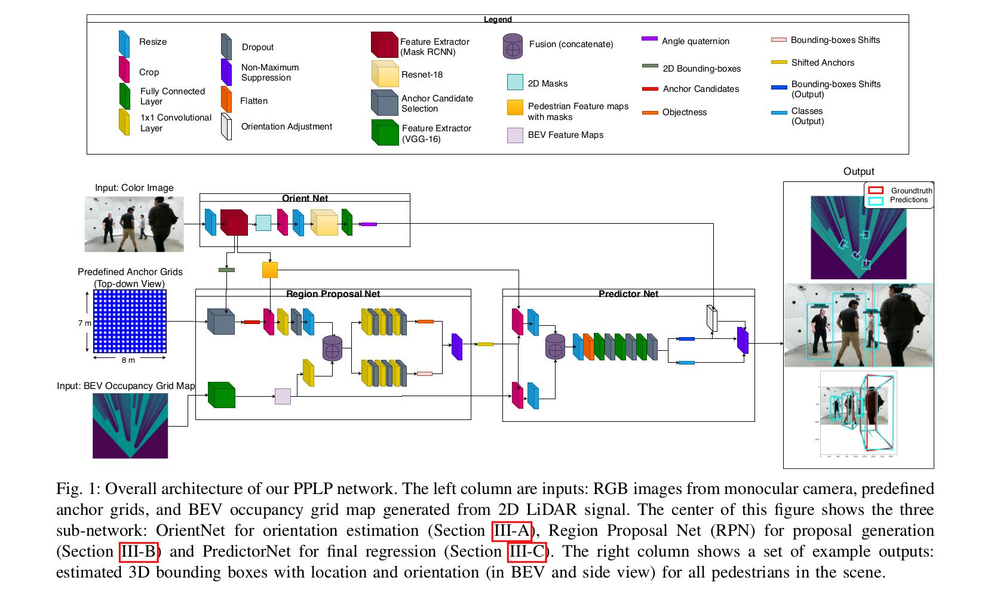
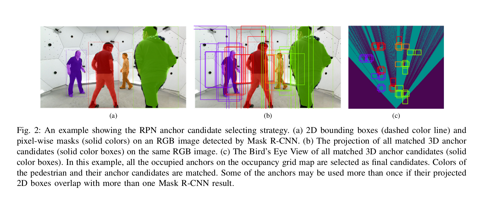
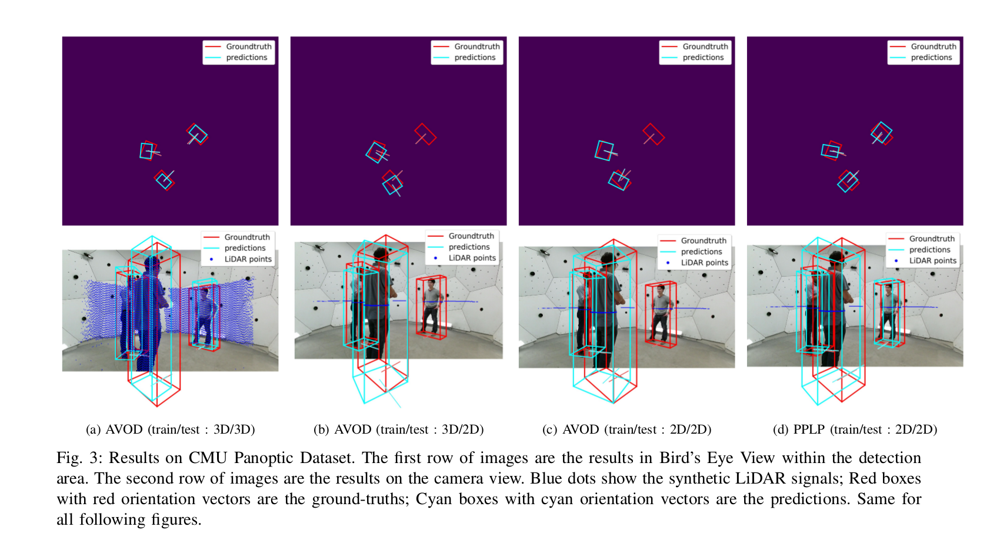
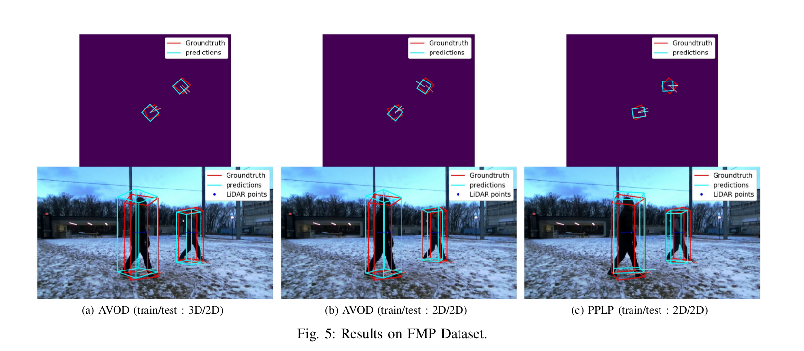
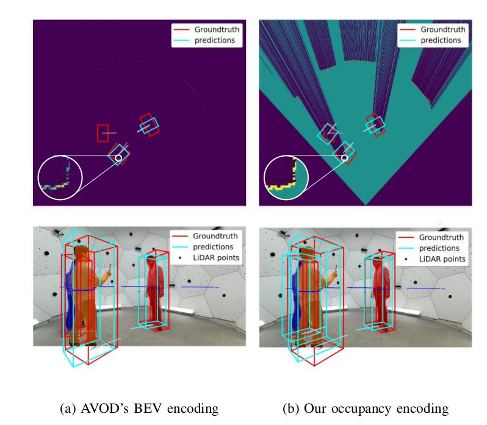
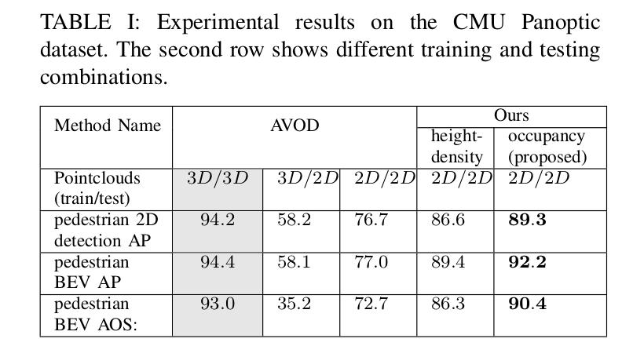

#  PPLP : Pedestrian Planar LiDAR Pose Network for Oriented Pedestrian Detection Based on Planar LiDAR and Monocular Camera

This repository contains the public release of the Python implementation of Pedestrian Planar LiDAR Pose Network (PPLP) Network for Oriented Pedestrian Detection Based on Planar LiDAR and Monocular Camera, along with an implementation of Aggregate View Object Detection (AVOD) method as the baseline.

We appreciate if you could cite our paper:
```
TODO
```

### Images
1. **Overall Architecture**:
   
2. **A sample from CMU dataset:**
   
3. **Comparison on CMU dataset:**
   
4. **Comparison on  FMP dataset:**
   
5. **Our encoding vs AVOD's encoding of LiDAR signal**:
   
6. **Result comparison:**
   


## Getting Started
Implemented and tested on Ubuntu 16.04 with Python 3.5 and Tensorflow 1.3.0.

1. Clone this repo
2. Install Python dependencies (also tested with tensorflow-gpu 1.8.0)
```bash
cd PPLP
pip3 install -r requirements.txt
pip3 install tensorflow-gpu==1.3.0
```

3. Add `PPLP (top level)` and `PPLP/wavedata` to your PYTHONPATH
For virtualenv wrapper users
```bash
add2virtualenv .
add2virtualenv wavedata
```

For nonvirtualenv users
```bash
export PYTHONPATH=$PYTHONPATH:'/path/to/PPLP'
export PYTHONPATH=$PYTHONPATH:'/path/to/PPLP/wavedata'
```

4. Compile integral image library in wavedata
```bash
sh scripts/install/build_integral_image_lib.bash
```

5. Our work uses Protobufs to configure model and training parameters. Before the framework can be used, the protos must be compiled (from top level folder):
If you have old protos files, clear them first:
```bash
sh pplp/protos/clear_protos.sh
```
Then compile the new protos files:
```bash
sh pplp/protos/run_protoc.sh
```

Alternatively(only if the above commands failed), you can run the `protoc` command directly:
```bash
protoc pplp/protos/*.proto --python_out=.
```

6. Install pyntcloud for pointcloud reading:
```sudo pip3 install git+https://github.com/daavoo/pyntcloud```

(Please make sure you have minimum requirements indicated here: https://github.com/daavoo/pyntcloud/blob/master/docs/installation.rst)

## Training
### Dataset
<!-- To train on the [Panoptic Object Detection Dataset]
- Download Panoptic dataset. (TO DO: Add dataset links)
- go to `pplp/protos/panoptic_dataset.proto` and change the dataset path. Then rebuild protos files.

<!-- To train on the [Kitti Object Detection Dataset]:
- Download the data (http://www.cvlibs.net/datasets/kitti/eval_object.php?obj_benchmark=3d) and place it in your home folder at `~/Kitti/object`
- Go [here](https://drive.google.com/open?id=1yjCwlSOfAZoPNNqoMtWfEjPCfhRfJB-Z) and download the `train.txt`, `val.txt` and `trainval.txt` splits into `~/Kitti/object`. Also download the `planes` folder into `~/Kitti/object/training`

<!-- No matter which dataset you choose:
The folder should look something like the following:
```
Kitti
└── object
    ├── testing
    │   ├── calib
    │   │   ├── xxxxxx.txt
    │   │   └── xxxxxx.txt
    │   ├── image_2
    │   │   ├── xxxxxx.png
    │   │   └── xxxxxx.png
    │   └── velodyne
    │       ├── xxxxxx.bin
    │       └── xxxxxx.bin
    ├── training
    │   ├── calib
    │   │   ├── xxxxxx.txt
    │   │   └── xxxxxx.txt
    │   ├── image_2
    │   │   ├── xxxxxx.png
    │   │   └── xxxxxx.png
    │   ├── label_2
    │   │   ├── xxxxxx.txt
    │   │   └── xxxxxx.txt
    │   ├── planes
    │   │   ├── xxxxxx.txt
    │   │   └── xxxxxx.txt
    │   └── velodyne
    │       ├── xxxxxx.bin
    │       └── xxxxxx.bin
    ├── train.txt
    └── val.txt
​``` -->

### Mini-batch Generation
The training data needs to be pre-processed to generate mini-batches for the RPN. To configure the mini-batches, you can modify the config files under path: `pplp/configs/mb_preprocessing`. By default it processes the *Pedestrian* class. Theoretically you can use our PPLP network on other classes as well if you have proper dataset for that.

Note: This script does parallel processing with `num_[class]_children` processes for faster processing. This can also be disabled inside the script by setting `in_parallel` to `False`.

To generate mini-batches for Panoptic dataset(for PPLP and AVOD(2D)):
​```bash
cd PPLP
python3 scripts/preprocessing/gen_mini_batches_from_panoptic_dataset.py --pipeline_config=pplp/configs/pplp_pedestrian_panoptic.config
```

or to generate mini-batches for Panoptic dataset(for AVOD(3D)):
```bash
cd PPLP
python3 scripts/preprocessing/gen_mini_batches_3d_from_panoptic_dataset.py --pipeline_config=pplp/configs/avod_3d_pedestrian_panoptic.config
```

Once this script is done, you should now have the following folders inside `pplp/data`:
```
data
├── label_clusters
|   └── xxxxxx
└── mini_batches
    └── xxxxxx
```

### Training Configuration
There are sample configuration files for training inside `pplp/configs`. You can train on the example config, or modify an existing configuration. To train a new configuration, copy a config, e.g. `pplp_example.config`, rename this file to a unique experiment name and make sure the file name matches the `checkpoint_name: 'pplp_example'` entry inside your config.

### Run Trainer
Training defaults to using GPU device 1, and the `train` split. You can specify using the GPU device and data split.

**To start AVOD(baseline, train with 2D LiDAR) training on Panoptic dataset, run the following**:
```bash
python3 pplp/experiments/run_avod_panoptic_training.py --pipeline_config=pplp/configs/avod_pedestrian_panoptic.config  --device='0' --data_split='train'
```

**To start AVOD(baseline, train with 3D LiDAR, for comparison only) training on Panoptic dataset, run the following**:

```bash
python3 pplp/experiments/run_avod_3d_panoptic_training.py --pipeline_config=pplp/configs/avod_3d_pedestrian_panoptic.config  --device='0' --data_split='train'
```

**To Start PPLP(ours) training on Panoptic dataset, we should make the orient_batches and build the groundtruth for OrientNet**:
(This step can be skipped if you download the 'data' folder from "TODO", and placed them under path: 'PPLP/pplp')
```bash
python3 scripts/preprocessing/gen_orient_batches.py
```

There should be a 'Pedestrian[orient]' folder generated under folder "PPLP/pplp/data/mini_batches/iou_2d/panoptic/train/lidar".

Then we should modify these results according to the MaskRCNN detections, following the instruction here: "TODO". The groundtruth files should contain only orientation for each pedestrians in the same order as the order of the MaskRCNN results.

**To Start OrientNet training on Panoptic dataset**:
```bash
python3 pplp/experiments/run_orientnet_panoptic_training.py --pipeline_config=pplp/configs/orientation_pedestrian_panoptic.config --device='0' --data_split='train'
```

**To build OrientNet results for PPLPNet**:
(This step can be skipped if you download the 'data' folder from "TODO", and placed them under path: 'PPLP/pplp')

The PPLPNet is trained after the OrientNet is finished. So if we want to train the PPLPNet, we shall first generate detection results from OrientNet and save the results in 'npy' files and put them under "PPLP/pplp/data/mini_batches/iou_2d/panoptic/train/lidar/Pedestrian[orient_pred]". For details, see the "To start evaluation for OrientNet..." part of "Run Evaluator".

**To Start PPLPNet training on Panoptic dataset**:
```bash
python3 pplp/experiments/run_pplp_panoptic_training.py --pipeline_config=pplp/configs/pplp_pedestrian_panoptic.config --device='0' --data_split='train'
```

Depending on your setup, training should take approximately 16 hours with a Titan Xp, and 20 hours with a GTX 1080. If the process were interrupted, training (or evaluation) would continue from the last saved checkpoint if it exists.

### Run Evaluator
**Read this block first.**
Delete old prediction files if you are not running for the first time!(directory might be something like this: `pplp/data/outputs/pplp_pedestrian_panoptic/predictions`).
Then make sure you configure these shell scripts correctly(especially the path of your dataset):

`scripts/offline_eval/panoptic_pplp_eval/run_eval_05_iou.sh`

`scripts/offline_eval/panoptic_pplp_eval/run_eval.sh`

`scripts/offline_eval/panoptic_pplp_eval/all_eval.sh`

or

`scripts/offline_eval/kitti_native_eval/run_eval_05_iou.sh`

`scripts/offline_eval/kitti_native_eval/run_eval.sh`

`scripts/offline_eval/kitti_native_eval/all_eval.sh`

If you want to change the evaluation threshold, it is in: `pplp/protos/eval.proto`. Default value is 0.3. Remember to `sh pplp/protos/clear_protos.sh` and then `sh pplp/protos/run_protoc.sh` if you changed anything.

We are trying to use the C++ code from KITTI dataset to evaluate the predeiction results. So please make sure the settings in `scripts/offline_eval/panoptic_pplp_eval/evaluate_object_3d_offline.cpp` and `scripts/offline_eval/panoptic_pplp_eval/evaluate_object_3d_offline_05_iou.cpp` are all correct. Especially `const double N_SAMPLE_PTS` (default=41 in KITTI dataset).

**To start evaluation for AVOD method on Panoptic dataset, run the following, (Optional) With additional options**:

Before you run, please make sure the model settings in function `run_latest_checkpoints()` inside `avod_panoptic_evaluator.py` is all correct!

Evaluate AVOD(trained by 2D LIDAR signal) method:
```bash
python3 pplp/experiments/run_avod_panoptic_evaluation.py --pipeline_config=pplp/configs/avod_pedestrian_panoptic.config --device='0' --data_split='val'
```

Evaluate AVOD(trained by 3D LIDAR signal) method:
```bash
python3 pplp/experiments/run_avod_3d_panoptic_evaluation.py --pipeline_config=pplp/configs/avod_3d_pedestrian_panoptic.config --device='0' --data_split='val'
```

**To start evaluation for PPLP method on Panoptic dataset, run the following, (Optional) With additional options**:

Before you run, please make sure the model settings in function `run_latest_checkpoints()` inside `pplp_panoptic_evaluator.py` is all correct!
```bash
python3 pplp/experiments/run_pplp_panoptic_evaluation.py --pipeline_config=pplp/configs/pplp_pedestrian_panoptic.config --device='0' --data_split='val'
```

**To start evaluation for OrientNet on Panoptic dataset, run the following, (Optional) With additional options**:

Before you run, please make sure the model settings in function `run_latest_checkpoints()` inside `orientnet_panoptic_evaluator.py` is all correct!
```bash
python3 pplp/experiments/run_orientnet_panoptic_evaluation.py --pipeline_config=pplp/configs/orientation_pedestrian_panoptic.config --device='0' --data_split='val'
```

**To start evaluation for PPLP method on Panoptic dataset, run the following, (Optional) With additional options**:

Before you run, please make sure the model settings in function `run_latest_checkpoints()` inside `pplp_panoptic_evaluator.py` is all correct!
```bash
python3 pplp/experiments/run_pplp_panoptic_evaluation.py --pipeline_config=pplp/configs/pplp_pedestrian_panoptic.config --device='0' --data_split='val'
```

The evaluator has two main modes, you can either evaluate a single checkpoint, a list of indices of checkpoints, or repeatedly. The evaluator is designed to be run in parallel with the trainer on the same GPU, to repeatedly evaluate checkpoints. This can be configured inside the same config file (look for `eval_config` entry).

Note: In addition to evaluating the loss, calculating accuracies, etc, the evaluator also runs the KITTI native evaluation code on each checkpoint. Predictions are converted to KITTI format and the AP is calculated for every checkpoint. The results are saved inside `scripts/offline_eval/results/avod_cars_example_results_0.1.txt` where `0.1` is the score threshold.

### Viewing Results
All results should be saved in `pplp/data/outputs`. Here you should see `proposals_and_scores` and `final_predictions_and_scores` results.

**To visualize the AVOD Panoptic results**:

**Remember, the script needs to be configured** to your specific experiments. Run `python3 demos/show_predictions_2d_avod_panoptic.py`.

**To visualize the PPLP Panoptic results**:

**Remember, the script needs to be configured** to your specific experiments. Run `python3 demos/show_predictions_2d_pplp_panoptic.py`.

**To visualize the OrientNet Panoptic results**:

**Remember, the script needs to be configured** to your specific experiments. Run `python3 demos/show_predictions_2d_orientnet_panoptic.py`.

**To visualize the PPLP Panoptic results**:

**Remember, the script needs to be configured** to your specific experiments. Run `python3 demos/show_predictions_2d_pplp_panoptic.py`.

Run `python3 scripts/offline_eval/plot_ap.py` will plot the AP vs. step, and print the 5 highest performing checkpoints for each evaluation metric at the moderate difficulty.
